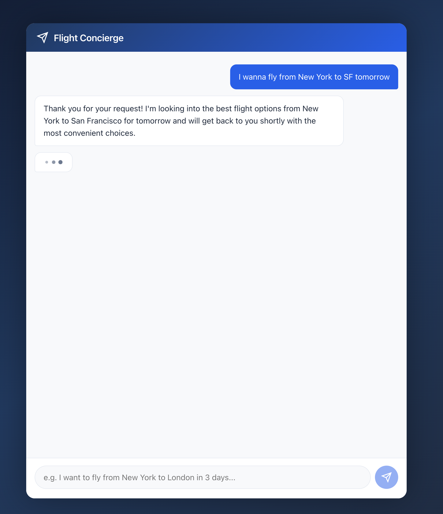

# Flight Concierge UI

A lightweight chat interface for a CrewAI Enterprise-powered flight booking agent. Built with Flask, it uses **Server-Sent Events (SSE)** for real-time streaming and **webhooks** to receive updates from CrewAI Enterprise automations.



## Architecture

```
User → Flask /api/start → CrewAI Enterprise /kickoff
                                  ↓
                     CrewAI runs automation
                                  ↓
          /webhook/messages ← CrewAI sends messages
          /webhook/feedback ← CrewAI requests human input
                  ↓
        SSE stream pushes updates to browser
                  ↓
        User feedback → /api/feedback → CrewAI callback URL
```

## SSE Streaming

The frontend opens a persistent `EventSource` connection to `/api/stream/<flow_id>`. Each session maintains a queue; when a webhook arrives, Flask pushes a JSON snapshot of the session state through that queue to the browser in real time—no polling required.

## Webhook Endpoints

| Endpoint | Description |
|---|---|
| `POST /webhook/messages` | Receives agent messages from CrewAI Enterprise and forwards them to the SSE stream |
| `POST /webhook/feedback` | Receives human-in-the-loop feedback requests; surfaces a feedback UI to the user |

## Other Endpoints

| Endpoint | Description |
|---|---|
| `POST /api/warmup` | Warms up the CrewAI Enterprise deployment |
| `POST /api/start` | Kicks off a new conversation (`/kickoff`) |
| `GET /api/stream/<flow_id>` | SSE stream for a given conversation |
| `POST /api/feedback/<flow_id>` | Submits user feedback back to CrewAI via the callback URL |

## Setup

```bash
cp .env.example .env
# Fill in CREWAI_ENTERPRISE_URL and CREWAI_ENTERPRISE_TOKEN
uv run flask run -p 5001
```

**Environment variables:**

| Variable | Description |
|---|---|
| `CREWAI_ENTERPRISE_URL` | Base URL of your CrewAI Enterprise deployment |
| `CREWAI_ENTERPRISE_TOKEN` | Bearer token for authenticating with CrewAI Enterprise |

## Stack

- **Backend:** Flask + Gunicorn (threaded workers)
- **Frontend:** Vanilla JS with `EventSource`, Marked.js, DOMPurify
- **Deployment:** Heroku (`Procfile` included)
